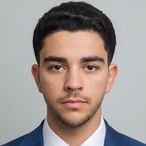
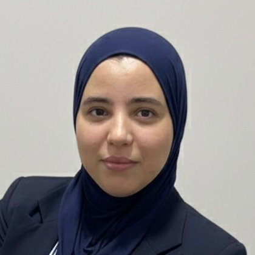
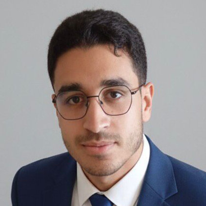
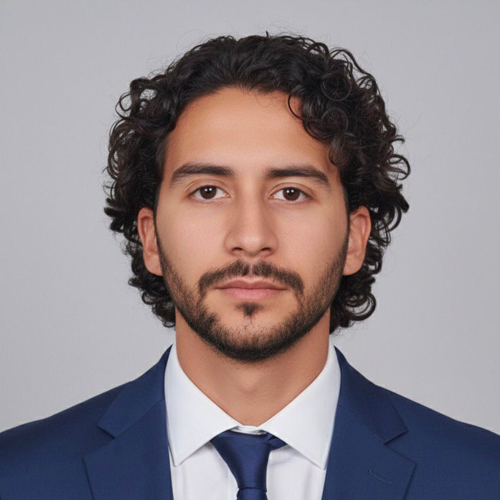
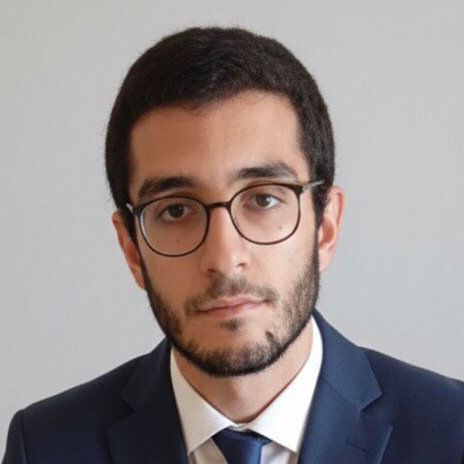
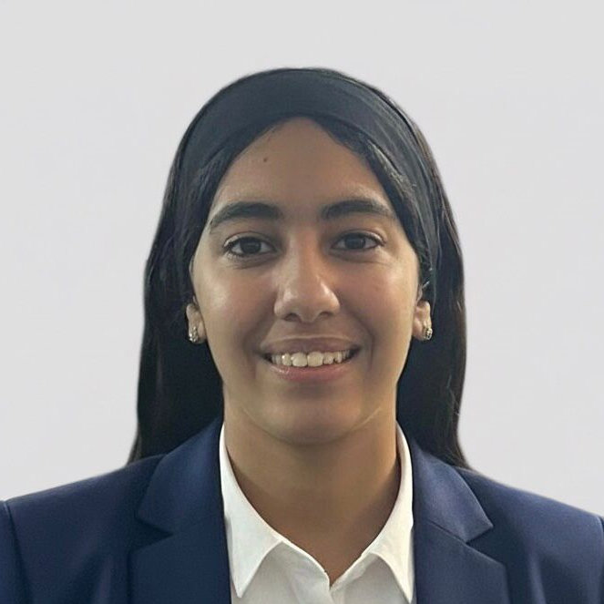
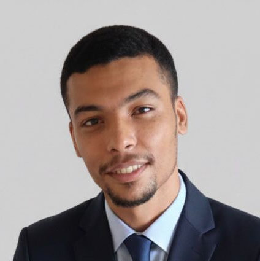
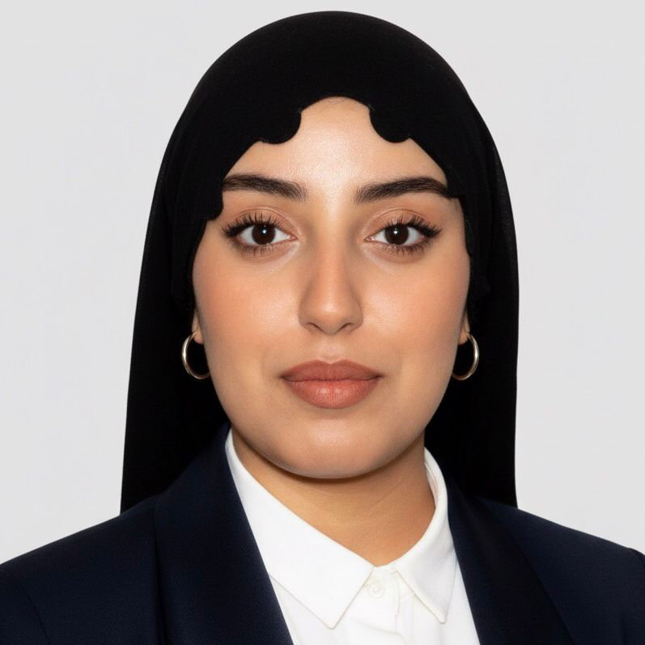
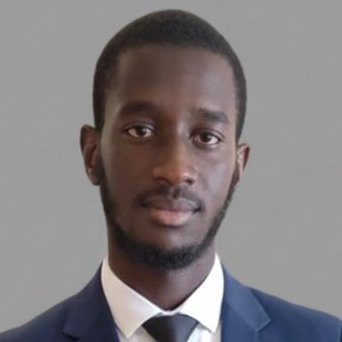

# Le Bureau Exécutif

## Mandat 2025-2026 : Stratégie & Exécution

Le Bureau Exécutif coordonne l'ensemble des activités d'AéroENSEM, de la conception technique à la gestion des partenariats industriels. Notre mission principale est d'assurer l'allocation optimale des ressources pour nos projets de recherche (systèmes embarqués, aéronautique, IA) et de garantir la livraison des cahiers des charges dans des délais rigoureux.

**Axes stratégiques actuels :**
- **R&D Appliquée** : Pilotage des projets techniques à fort impact (Logistique d'urgence spatiale, conception de drones de surveillance).
- **Synergie Industrielle** : Consolidation des relations avec les acteurs de l'aéronautique marocaine pour financer nos recherches.
- **Transmission** : Formation continue des membres de l'ENSEM aux standards d'ingénierie professionnels.

---

## La Direction Stratégique

    La Présidence et Vice-Présidence définissent l'orientation à long terme du club, agissant comme l'interface décisionnelle principale face aux directions académiques de l'ENSEM et aux autorités industrielles.

    <!-- Président -->
    

        

            
        

        

            

                <h3>ABOUDRAR Younes</h3>
                
Président

                
"Chaque vol commence par un premier pas en avant."

            

            

                <a href="https://www.linkedin.com/in/younes-aboudrar/" target="_blank" title="Profil LinkedIn"><i class="fab fa-linkedin"></i></a>
                <a href="mailto:younes.aboudrar.etu24@ensem.ac.ma" title="Contacter le Président"><i class="fas fa-envelope"></i></a>
            

        

    

    <!-- Vice-Présidente -->
    

        

            
        

        

            

                <h3>BEL-KADI Soumia</h3>
                
Vice-Présidente

                
"Une fois que vous aurez goûté au vol, vous marcherez à jamais les yeux tournés vers le ciel."

            

            

                <a href="https://www.linkedin.com/in/soumia-belkadi-496ba434b/" target="_blank" title="Profil LinkedIn"><i class="fab fa-linkedin"></i></a>
                <a href="mailto:soumia.bel-kadi.etu24@ensem.ac.ma" title="Contacter le Président"><i class="fas fa-envelope"></i></a>
            

        

    

---

## Le Pôle Technique, Formations & Partenariats

    Ce macro-département est le moteur d'AéroENSEM. Ici, les concepts théoriques deviennent des prototypes fonctionnels. Il rassemble nos chefs de projets (CAO, CFD, Systèmes Embarqués), nos formateurs, et le pôle Sponsoring chargé de financer ces innovations.

    <!-- Chef de Projets -->
    

        

            
        

        

            

                <h3>FAQIHI Ayoub</h3>
                
Chef de Projets

                
"Un test vaut mille prédictions."

            

            

                <a href="https://www.linkedin.com/in/ayoub-faqihi-693715368/" target="_blank" title="Profil LinkedIn"><i class="fab fa-linkedin"></i></a>
                <a href="mailto:ayoub.faqihi.etu24@ensem.ac.ma" title="Contacter le Président"><i class="fas fa-envelope"></i></a>
            

        

    

    <!-- Sponsoring -->
    

        

            
        

        

            

                <h3>MAATAOUI Fahd</h3>
                
Responsable Sponsoring

                
"Soutenir l'ingénierie étudiante, c'est financer la souveraineté de notre industrie."

            

            

                <a href="https://www.linkedin.com/in/fahd-maataoui-50698b35a/" target="_blank" title="Profil LinkedIn"><i class="fab fa-linkedin"></i></a>
                <a href="mailto:fahd.maataoui.etu24@ensem.ac.ma" title="Contacter le Président"><i class="fas fa-envelope"></i></a>
            

        

    

    <!-- Formations -->
    

        

            
        

        

            

                <h3>KAMOUNE Yahya</h3>
                
Responsable de Formations

                
"Chaque minute passée à apprendre est un pas de plus vers l’excellence."

            

            

                <a href="https://www.linkedin.com/in/yahya-kamoune-a0423524b/" target="_blank" title="Profil LinkedIn"><i class="fab fa-linkedin"></i></a>
                <a href="mailto:yahya.kamoune.etu24@ensem.ac.ma" title="Contacter le Président"><i class="fas fa-envelope"></i></a>
            

        

    

---

## Événements & Logistique

    Ce pôle assure la gestion de la chaîne logistique, l'allocation du matériel technique (budget, capteurs, outillage), et la planification opérationnelle complète de nos grandes conférences comme la JAE, incluant la gestion des relations avec les conférenciers industriels.

    <!-- Respo Event -->
    

        

            
        

        

            

                <h3>BOUHDILA Najoua</h3>
                
Responsable Conférences et Événements

                
"Nous rassemblons l'industrie aéronautique de demain autour d'une vision commune."

            

             

                <a href="https://www.linkedin.com/in/najoua-bouhdila-236878277/" target="_blank" title="Profil LinkedIn"><i class="fab fa-linkedin"></i></a>
                <a href="mailto:najoua.bouhdila.etu24@ensem.ac.ma" title="Contacter le Président"><i class="fas fa-envelope"></i></a>
            

        

    

    <!-- Co-Respo Event -->
    

        

            
        

        

            

                <h3>GUOURCH Mohammed</h3>
                
Co-Responsable Conférences et Événements

                
"L'innovation prend tout son sens lorsqu'elle est partagée avec le monde industriel."

            

             

                <a href="https://www.linkedin.com/in/mohammed-guourch-16a529212/" target="_blank" title="Profil LinkedIn"><i class="fab fa-linkedin"></i></a>
                <a href="mailto:mohammed.guourch.etu24@ensem.ac.ma" title="Contacter le Président"><i class="fas fa-envelope"></i></a>
            

        

    

    <!-- Logistique -->
    

        

            
        

        

            

                <h3>BELKACEM Ilyas</h3>
                
Responsable Logistique et Mobilisation

                
"La logistique est le moteur silencieux qui transforme les rêves en réalité."

            

             

                <a href="https://www.linkedin.com/in/belkacem-ilyas-224818340/" target="_blank" title="Profil LinkedIn"><i class="fab fa-linkedin"></i></a>
                <a href="mailto:ilyas.belkacem.etu24@ensem.ac.ma" title="Contacter le Président"><i class="fas fa-envelope"></i></a>
            

        

    

---

## Image & Média

    Département en charge de la couverture médiatique nationale, de l'identité visuelle de nos campagnes et de la documentation de nos avancées techniques. "Si l'ingénierie est le corps, la communication en est la voix."

    <!-- Media -->
    

        

            
        

        

            

                <h3>RADI Douae</h3>
                
Responsable Communication (Design & Média)

                
"L'excellence technique n'a d'impact que si elle est communiquée avec ambition."

            

            

                <a href="https://www.linkedin.com/in/douae-radi-9149822a9/" target="_blank" title="Profil LinkedIn"><i class="fab fa-linkedin"></i></a>
                <a href="mailto:j134348724@ensem.ac.ma" title="Contacter le Président"><i class="fas fa-envelope"></i></a>
            

        

    

    <!-- Co-Media -->
    

        

            
        

        

            

                <h3>MUHAMMAD Ramadan</h3>
                
Co-Responsable Communication

                
"Se réunir est un début, rester ensemble est un progrès, travailler ensemble est la réussite."

            

            

                <a href="https://www.linkedin.com/in/muhamad-ramadan-99aba3338/" target="_blank" title="Profil LinkedIn"><i class="fab fa-linkedin"></i></a>
                <a href="mailto:muhammadramadan.djibrillamaiga.etu24@ensem.ac.ma" title="Contacter le Président"><i class="fas fa-envelope"></i></a>
            

        

    

---

    <h2>Rejoindre les Équipes Opérationnelles</h2>
    
L'intégration au sein d'AéroENSEM est conditionnée par un processus de sélection technique et d'évaluation des soft skills. Nous recherchons des profils hautement rationnels, capables de travailler sous pression et de respecter des protocoles stricts.

    <a href="/contact/" class="cta-button">Voir les processus de recrutement</a>

---

> Auteur: <no value>  
> URL: http://localhost:59322/equipe/  

