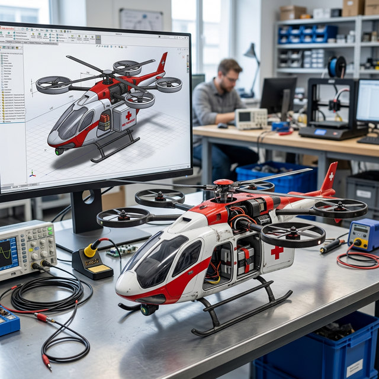

# DroneCare / Rescue Drone

## DroneCare : Plus qu'un Drone, une Solution

Le projet DroneCare est le fleuron de l'innovation d'AéroENSEM. Contrairement aux drones de loisir, DroneCare est une **solution logistique autonome** conçue pour transporter du matériel médical critique (poches de sang, sérums antivenimeux, défibrillateurs) vers les zones enclavées du Maroc.

### Spécifications Techniques

- **Structure** : Châssis en composites de fibres de carbone pour optimiser le ratio poids/résistance.
- **Avionique** : Contrôleur de vol sous Pixhawk avec intégration algorithmique propre pour l'évitement d'obstacles.
- **Charge Utile (Payload)** : Compartiment isotherme modulaire de 3.5 kg.

### Timeline Technologique

- **📍 Phase 1** : Conception CAO, simulations aérodynamiques sous ANSYS et étude de viabilité (Terminé).
- **📍 Phase 2** : Assemblage, soudure de précision, et intégration des systèmes embarqués (En cours - Actuel).
- **📍 Phase 3** : Tests en soufflerie et premiers vols d'essai sur site (Prévu Q4 2026).

Ce projet incarne le deuxième pilier de notre ADN : *L'ingénierie au service des citoyens marocains.*

---

> Auteur: <no value>  
> URL: http://localhost:59322/projets/dronecare/  

