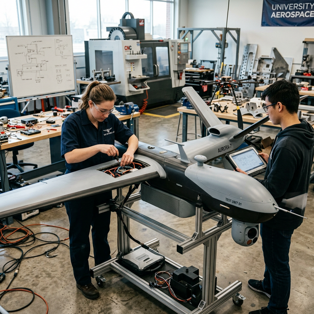

# MQ-9 Reaper (Maquette Innovante)

## Objectif & Vision

Un projet centré sur l'innovation pour la surveillance, la sécurité, et la souveraineté technologique. La reproduction d'un système de classe MALE (Medium Altitude Long Endurance) comme le *MQ-9 Reaper* permet à nos élèves-ingénieurs de se confronter à des problématiques de stabilité aérodynamique complexes.

### Au-delà du Modélisme

Ce projet n'est pas un kit préfabriqué. Il implique :
1. La redéfinition du profil de l'aile pour une fabrication artisanale à grande échelle.
2. Le calcul du centre de gravité dynamique avec charge utile.
3. L'intégration de systèmes de télémétrie UHF/VHF.

### Timeline du Projet

- **📍 Phase 1** : Etude d'architecture complète, calculs de propulsion et choix des servomoteurs (Terminé).
- **📍 Phase 2** : Prototypage de la structure de base dans les ateliers de l'ENSEM (En cours).
- **📍 Phase 3** : Intégration de la suite logicielle embarquée et tests de contrôle à longue distance (Prévu 2027).

---

> Auteur: <no value>  
> URL: http://localhost:59322/projets/mq9-reaper/  

